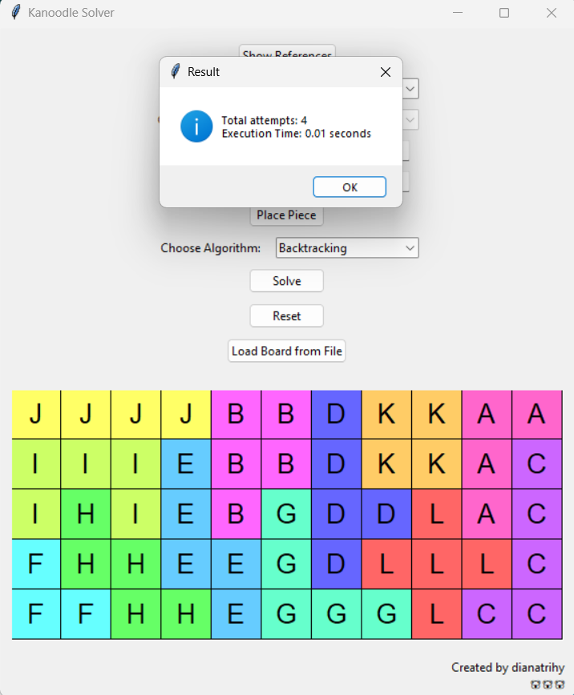

# Kanoodle Solver
> Kanoodle adalah sebuah permainan teka-teki yang melibatkan menyusun bentuk geometris menggunakan potongan-potongan kecil yang memiliki berbagai bentuk dan ukuran. Tujuan dalam Kanoodle adalah menyusun potongan-potongan tersebut sehingga sesuai dengan pola yang diberikan. Pada kanoodle original, papan berukuran 5x11 dan potongan geometris berjumlah 12 dengan bentuk berbeda beda.

## Table of Contens
* [General Info](#general-information)
* [Programming Language Used](#programming-language-used)
* [Features](#features)
* [Screenshots](#screenshots)
* [Setup](#setup)
* [Usage](#usage)
* [Author](#author)

## General Information
- Untuk mendapatkan solusi optimal dalam permainan Kanoodle, dilakukan pembangunan algoritma runut-balik (backtracking) serta algoritma brute force sebagai pembanding. Hal-hal yang dibandingkan antara lain memori, dan waktu yang dibutuhkan. 

## Programming Language Used
- Python 3.11.0

## Features
-	Melihat kamus atau referensi setiap piece dan orientasinya melalui tombol yang memunculkan jendela (window) lain berisi gambar terkait.
-	Memilih piece yaitu antara huruf A hingga L yang akan ditempatkan ke board.
-	Memilih orientasi dari piece yang sudah dipilih sebelumnya.
-	Memilih baris dan kolom untuk menentukan posisi peletakkan piece pada board.
-	Meletakkan piece terpilih berdasarkan orientasi dan posisi yang sudah dimasukkan.
-	Memilih jenis algoritma antara runut-balik atau brute force untuk menyelesaikannya.
-	Menyelesaikan kanoodle dengan board sesuai visualisi menggunakan algoritma terpilih.
-	Tombol reset untuk mengembalikan kondisi program ke kondisi semula.
-	Memuat konfigurasi papan dari sebuah file text yang valid.
-	Program dapat menampilkan solusi kanoodle berdasarkan kondisi-kondisi yang telah dipilih sebelumnya, beserta jumlah percobaan peletakkan piece pada board dan waktu eksekusinya.

## Screenshots

## Setup
- pastikan Anda memiliki compiler python
- tambahkan PIL (Python Imaging Library) dengan cara `pip install Pillow`

## Usage
- Masuk ke dalam direktori "src"
- Buka terminal 
- Ketik `python gui.py` untuk menjalankan program hingga muncul GUI program

## Author
- Diana Tri Handayani | 13522104